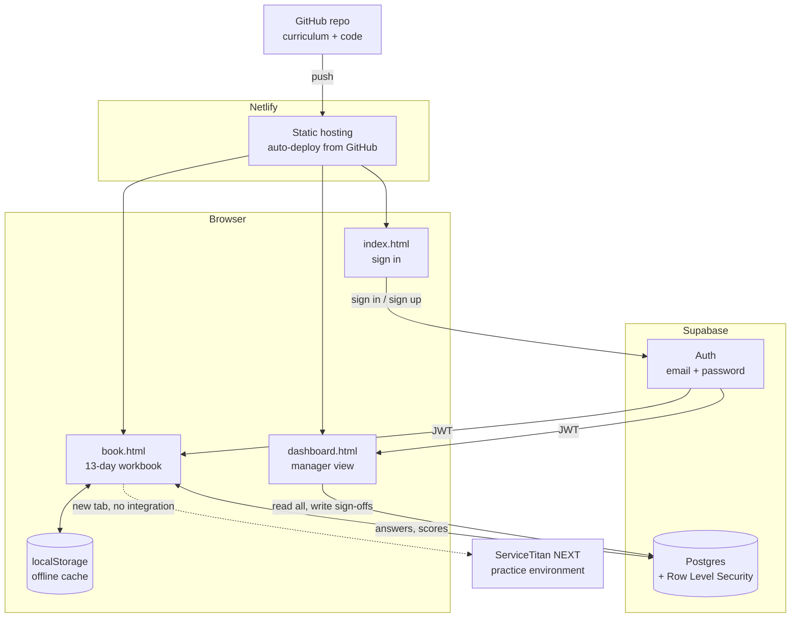

# CSR Academy — Product Requirements

**Owner:** Lauren Cano, Customer Service Manager
**Status:** v1 scope locked · most of the app is built and unverified
**Last updated:** 20 August 2026
**Stack:** Supabase · Netlify · GitHub

---

## 1. What this is

The Service Professionals CSR Academy is a **13-day** training curriculum for
call center reps, in three weeks:

| Week | Days | What it covers |
|---|---|---|
| **One — Foundation** | 1–5 | Culture and values · the Golden Call Flow · confidence, the $89 fee and memberships · empathy and de-escalation · assessment and the live-call gate |
| **Two — Trades & Products** | 6–10 | HVAC · plumbing · electrical · sales, rebates, OBR and permits · memberships |
| **Three — Application** | 11–13 | Ten live scenarios and first NEXT builds · documentation accuracy · membership maintenance builds and the membership lifecycle |

It exists as an interactive HTML book that saves answers in whatever browser the
rep happens to be sitting at. That is the problem: progress does not follow a rep
to a different computer, nothing survives a cleared cache, and none of it reaches
the manager. Completed workbooks come back as emailed text files or not at all.

**v1 turns the book into a real application:** every rep signs in with their
Service Professionals email, their answers and drill scores save to a
database, and managers get a live dashboard showing where each rep stands —
including the Day 5 gate that clears a rep to start taking live calls.

### Why it matters

Raising booking percentage is the department's top priority, and objection
handling is where calls are lost. The academy is where reps learn the call flow,
the $89 service fee bridge, and the membership rules that decide whether a call
books. Today there is no way to see whether a rep absorbed any of it until you
hear it on a live call.

---

## 2. Goals and non-goals

### Goals

| | Goal |
|---|---|
| G1 | A rep can stop mid-day on one computer and resume exactly where they left off on another |
| G2 | Managers can see every rep's progress and read their written answers without asking for a file |
| G3 | Drill performance is recorded, so a 1-on-1 can open with evidence instead of an impression |
| G4 | The Day 5 live-call gate is signed by a manager and cannot be self-signed |
| G5 | All 9 current reps run the academy to establish a baseline, then every new hire runs it |
| G6 | Zero password administration — no accounts to create, no passwords to issue. Resets remain manual; see F1 |
| G7 | When a procedure changes, a single day can be reassigned to reps who already finished |

### Non-goals for v1

- **Ongoing 1-on-1 coaching modules.** The bi-weekly training built from
  unbooked-call analysis stays outside this product. Most likely v2.
- **The rep scorecard.** Stays in its current form.
- **Unbooked call review and transcript analysis.** Separate workflow.
- **Anything for technicians or Comfort Advisors.** CSRs only.
- **Native mobile app.** The book must work on a tablet; that's the extent of it.
- **Certificates, badges, gamification.**
- **Locking the curriculum.** See the decision in F2 — the book is deliberately open.
- **Reading anything out of ServiceTitan.** The academy links *into* ServiceTitan
  and captures job numbers reps type; it never queries the ServiceTitan API.

---

## 3. Users and roles

| Role | Who | Can do |
|---|---|---|
| **Rep** | The 9 current CSRs, then every new hire | Work their own book; read their own answers, scores and sign-offs |
| **Manager** | Lauren, plus other managers and supervisors she designates | Read every rep's answers and scores; sign off days; set roles, cohorts, assigned days and active status |

No leadership read-only tier in v1. If wanted later it's a third role, not a
change to these two.

**Rep privacy expectation, to be stated at kickoff:** managers can read
everything a rep writes, including the personal reflections on Days 1 and 4, and
drill scores are recorded. The book is a work document, not a diary. Recording
performance quietly is a trust problem waiting to happen.

---

## 4. Architecture

**Why this stack fits:** the company already has team accounts on all three, so
nothing to procure. Supabase gives real authentication and, critically, Row Level
Security — access rules enforced by the database rather than the page, so a rep
opening dev tools cannot read a colleague's workbook. Netlify deploys on push, so
editing the curriculum is a git commit.

**No client-side framework and no CDN dependencies.** The data layer is plain
`fetch` against Supabase's REST and Auth endpoints (`public/assets/sp-api.js`).
This runs in a call center; one less thing that can fail to load, and the whole
data layer stays readable in one file.

**ServiceTitan is a link, not an integration.** The book opens NEXT in a new tab
and nothing more. No API, no credentials, no data flowing back.

---

## 5. Features

### F1 — Authentication (self-service, work email) · built

Reps create their own accounts with their `@service-professionals.com` email and
a password they choose. Nobody issues a password and nobody is added by hand.

**Decision: Google SSO was dropped in favour of self-service email signup.** The
Google route was fully configured — Cloud project, consent screen confirmed
Internal — and then set aside, because signup that anyone on the company domain
can complete themselves achieves the same goal with fewer moving parts and no
dependency on an OAuth client, a consent screen, or a second vendor. The Google
code remains in `sp-api.js` and can be re-enabled without a migration.

- **Create your account** is the first-run path: work email, a password of their
  choosing, straight into the book.
- Open signup is only safe because the door behind it is shut. A trigger on
  `auth.users` rejects account creation for any address outside the company
  domain, so the page can be open while the database stays closed. This is the
  same `enforce_email_domain()` that previously backed up the consent screen; it
  is now the primary control rather than the second layer.
- A profile row is created automatically on signup. **There is no user
  administration** — no accounts to create, no passwords to hand out.
- **Email confirmation is off.** Supabase's built-in sender is rate-limited and
  not production-grade; leaving confirmation on would strand a cohort signing up
  the same morning. The domain trigger is the real gate, and the confirmation
  email adds delay rather than safety.
- Password resets go through that same sender and are therefore best-effort. A
  manager resetting directly in Supabase is the reliable path, and custom SMTP is
  the fix if resets ever become common. **This is the one part of G6 that
  survives as real administrative work.**
- Sessions persist across browser restarts and refresh silently.

**Accepted risk:** with confirmation off, someone on the company domain could
register using a colleague's address. The population is nine known people on a
closed domain, a manager sees every account in the People tab, and the content is
training material rather than anything sensitive. Turning confirmation on later
is a single setting once SMTP is configured.

### F2 — The workbook · built

- Answers save about a second after the rep stops typing. No save button.
- Save state is visible and honest: *Saved to your account* / *Saving…* /
  *Working offline*.
- **Offline tolerance is a hard requirement.** Every answer is also written to the
  browser as a cache. If the connection drops, typing keeps working and the next
  successful save pushes it up. A dropped connection must never cost a rep a day's
  work.
- The account is the source of truth. On load the book shows the cache
  immediately, then reconciles.
- One row per rep per day, so a day is written atomically and two open tabs cannot
  half-overwrite each other.
- Reps can print and export their answers at any time.
- **Manager sign-off blocks are read-only for reps**, and show the manager's
  signature and notes once signed.

**Decision: the book is not gated.** A rep can open any day at any time. Locking
days behind sign-off would make the manager a hard bottleneck — one person out
sick stops an entire cohort — and the Day 5 live-call gate is a judgement about a
person, not a software state. Progress is *visible* rather than *enforced*: the
dashboard shows exactly who is where, and Day 5 stays a conversation.

### F3 — Drill scoring · built

Four kinds of graded exercise, 18 drills across the book:

| Kind | Where |
|---|---|
| `sorter` | Service vs. maintenance · $89 fee waived or applies · can-I-say-that · Advisor or plumber · due or not due |
| `mcq` | Days 11–13 — what do you do next, spot the dangerous mistake, booking path, trade assignment, billing-date math, which lifecycle action |
| `rank` | Plumbing urgency · electrical priority |
| `sequence` | The Golden Call Flow from memory |

- Every attempt is recorded: drill, score, max, and which specific items were wrong.
- **Every attempt is kept, not just the latest.** A rep who went 3/6 then 6/6 has
  learned something; keeping only the best hides that.
- A part-answered drill grades on screen but is not recorded — scoring half a
  drill against the full total would just read as a failure.
- MCQ locks after grading so a rep cannot click around to find the answer. *Try
  again* clears it and starts a fresh attempt.
- The dashboard shows per rep: best, latest, attempt count. And **across the
  team, per drill**: average, first-try average, failure rate. If seven of nine
  reps miss the $89 fee drill, that's a curriculum problem, not nine rep problems.
- Free-text answers are never auto-scored.

**Drill ids are permanent.** A drill id is the key its scores are filed under
forever, so ids are never reused or renamed. Current: `d2flow`, `d6sort`,
`d7rank`, `d8rank`, `d9route`, `d9say`, `d10fee`, `d11next`, `d11notdo`,
`d11price`, `d11appl`, `d12audit1`, `d12danger`, `d13path`, `d13due`, `d13trade`,
`d13comp`, `d13life`.

### F4 — Cohorts and day assignment · cohorts built, assignment new

All 9 current reps run the academy first to establish a baseline, then new hires
run it as they start. The product therefore compares people, not just tracks one.

- Each rep belongs to a named cohort (`Baseline 2026`, then by intake).
- Dashboard filters and groups by cohort, and compares a later cohort against the
  baseline group.
- **Per-day assignment (new in v1).** Procedures change — the install brand list
  changed mid-authoring, and the comp-months policy is new. When Day 10 or Day 13
  changes, a manager must be able to reassign *that day* to reps who already
  finished, and see who has completed the updated version.
  - A day can be assigned to an individual, a cohort, or everyone.
  - A reassigned day shows as outstanding for that rep without disturbing their
    original completion record.
  - Reassignment is a manager action, from the dashboard.

### F5 — Manager dashboard · built, plus additions

**Team progress.** Roster filtered by cohort: name, percent complete, days marked
done, days signed off, live-call status, drill count, last active. Summary tiles
include how many reps have been **quiet 3+ days**. With two or more cohorts, a
comparison table appears.

**Rep detail.** Per-day breakdown; expand a day to read that rep's actual written
answers grouped under the book's own section headings, with drill scores and
attempt history under each day. Printable, for walking into a 1-on-1 with the
rep's own words on paper.

**What the team fails.** Every drill ranked hardest first — average score,
first-try average, best-attempt average, failure rate — plus per-day average
completion.

**People.** Role, cohort, start date, active status. Deactivating removes someone
from the roster without deleting a word of their workbook. *To add:* assigned days
(F4).

**To add — NEXT build verification.** Day 13's ten build labs and the Day 11–12
NEXT labs each capture the **ServiceTitan job or appointment number** the rep
created. The dashboard surfaces those numbers together on the rep's Day 11–13
view so a manager can spot-check any of them in ServiceTitan in seconds. The
academy does not query ServiceTitan; it displays what the rep typed.

### F6 — Sign-offs and the Day 5 gate · built

Day 5 assesses whether a new CSR is ready to take live calls — the highest-stakes
moment in the curriculum.

- A day is signed off by a manager only. **Reps have no write access to sign-offs
  at the database level**, so a rep cannot sign their own day even by calling the
  API directly. Enforced by the absence of a write policy, not by hiding a button.
- Day 5 carries an explicit **Ready to begin taking live calls** flag, separate
  from "day complete".
- A sign-off records who signed it and when, is visible to the rep in their own
  book, and is editable by a manager (with the new signer and timestamp recorded).

### F7 — ServiceTitan NEXT links · built

Days 11–13 send reps into the NEXT environment to build practice appointments.

- Every NEXT button comes from **one constant** in `book.html`:
  `var NEXT_URL = "https://next.servicetitan.com/#/Calls"`. Change that line and
  every button follows.
- Links open in a new tab with `rel="noopener noreferrer"`.
- If the constant is empty, buttons render as *NEXT link not set yet* rather than
  navigating somewhere broken.
- **Never a URL containing `identityTrace` or `state`.** Those are single-use
  sign-in tokens tied to one person's session; they expire in minutes and must not
  be committed to a repo the whole team can read.
- Reps use practice customers only, never a real member's account.

### F8 — Curriculum maintenance · built

- Editing content is a git commit; Netlify redeploys.
- Answer keys are scoped per section (`d6s5.t2` = third textarea in Day 6's fifth
  section) so editing one section cannot misalign answers recorded elsewhere.
- **Known constraint:** adding or removing a field *inside an existing section*
  shifts the keys after it within that section, which would misalign historical
  answers there. Adding a new section or a new day is always safe. Now that
  per-day reassignment is in scope, in-section edits become more likely — move to
  explicit hand-authored ids before the second cohort starts. This remains the
  most likely source of future data corruption.
- The dashboard reads question labels *and* per-day field counts from `book.html`
  itself, so neither can drift out of sync with the curriculum.

---

## 6. Data model

| Table | Purpose | Key columns |
|---|---|---|
| `profiles` | One row per person | `id`, `full_name`, `role` (rep\|manager), `cohort`, `started_on`, `active` |
| `progress` | A rep's answers for one day | `user_id`, `day`, `answers` (jsonb), `filled`, `total`, `rep_done`, `updated_at` |
| `drill_attempts` | One row per attempt | `user_id`, `day`, `drill_id`, `drill_kind` (`sorter`\|`rank`\|`sequence`\|`mcq`), `drill_title`, `score`, `max_score`, `detail` (jsonb), `attempt_no`, `attempted_at` |
| `signoffs` | Manager sign-off per day | `user_id`, `day`, `signed_by`, `signed_at`, `ready_for_live_calls`, `notes` |
| `day_assignments` **(new)** | A day reassigned after completion | `user_id`, `day`, `assigned_by`, `assigned_at`, `reason`, `completed_at` |

**Views:** `rep_overview` (the roster), `drill_difficulty` (per-drill, team-wide),
`day_completion` (per-day averages). All run as the caller so RLS still applies.

`progress.answers` holds field-key → value rather than one row per field: a day is
one read and one write, which keeps sync simple and conflict-free. Querying a
single question across reps needs a JSON operator — fine, that's reporting, not a
hot path. **ServiceTitan job numbers live in `answers`** like any other field; they
are rep-typed text, not validated.

Nothing in the application deletes workbook history — deliberately no delete
policy on `progress` or `drill_attempts`.

---

## 7. Security model

Enforced by Row Level Security in Postgres, evaluated on every query with the
signed-in user's identity. The page is not the security boundary.

| Table | Rep reads | Rep writes | Manager reads | Manager writes |
|---|---|---|---|---|
| `profiles` | own row | own name only | all | all, incl. role and cohort |
| `progress` | own rows | own rows | all | — |
| `drill_attempts` | own rows | own rows, insert only | all | — |
| `signoffs` | own rows | **never** | all | all |
| `day_assignments` | own rows | mark own complete | all | all |

- The Supabase anon key ships in the browser. That is what it is for; it grants no
  data access on its own. The `service_role` key must never appear in the repo.
- A rep cannot promote themselves: a trigger rejects role or active-status changes
  by a non-manager.
- The domain restriction lives in the database, so it holds even if the OAuth
  consent screen is loosened.
- `drill_attempts` is insert-only for reps — scores cannot be edited after the fact.

**Accepted risk:** a manager is trusted fully — any manager can read every rep's
written reflections and sign the live-call gate. Appropriate at this team size; if
the manager group grows beyond a handful, restrict sign-off to a named subset.

---

## 8. Status and open work

Resolved since the first draft:

- ~~Login page treated any token callback as a password reset~~ — fixed;
  `finishSignIn()` returns a kind and only a recovery link reaches the
  new-password screen.
- ~~OAuth response shape unconfirmed~~ — both implicit and PKCE handled.
- ~~Drill scores not persisted~~ — built, four kinds, every attempt kept.
- ~~Role and cohort changes need the SQL editor~~ — People tab built.

Still open:

| # | Item | Notes |
|---|---|---|
| O1 | **Every Supabase path is untested** | No project exists yet. Auth, sync, dashboard queries and drill writes are written but unproven. Expect breakage on first run. This is the single biggest risk in the plan. |
| O2 | Per-day assignment (F4) | New table, manager UI, rep-side "reassigned" indicator. |
| O3 | Job-number capture (F5) | A field on each NEXT lab, surfaced together in the dashboard. |
| O4 | Z-line / trade line names | Day 13's trade reference table has fillable blanks pending the real line names. |
| O5 | Open / cancel membership click paths | Day 13 has these as write-in steps for a manager-led demo. Comp-months steps are written exactly. |
| O6 | Answer-key stability | See F8. Revisit before the second cohort. |

---

## 9. Build sequence

Each milestone is independently useful and verifiable. Don't start the next until
a real person has used the previous one.

**M0 — Get the accounts.** Establish who can create the Netlify site and the
Google Cloud OAuth client. **This is the schedule risk** — see §11. Nothing else
can start.

**M1 — Live for one rep.** Supabase project, schema, Google provider, Netlify
deploy. One real rep completes Day 1 on two different computers. *Done when:*
progress survives switching machines and appears in the dashboard.

**M2 — Sign-offs and the gate.** Sign-off flow, Day 5 live-call flag, rep-visible
sign-offs. *Done when:* a real Day 5 is signed and the rep sees it in their book.

**M3 — All nine reps, baseline cohort.** Cohorts, People admin, roster filtering.
*Done when:* all 9 are in `Baseline 2026` and working.

**M4 — Drill scoring verified.** Confirm attempts write correctly for all four
kinds; team drill-difficulty view. *Done when:* Lauren can name the drill her team
fails most.

**M5 — Assignment and verification.** Per-day reassignment (O2) and job-number
capture (O3). *Done when:* a changed Day 13 can be pushed to the whole team and
tracked.

**M6 — Reporting.** CSV shaped for the existing Smartsheets flow; printable rep
detail for 1-on-1s.

M1 and M2 are the minimum that replaces the paper workbook. M3–M6 are what make
it worth having built.

---

## 10. Success metrics

| Metric | Now | Target |
|---|---|---|
| Manager time chasing and collating workbooks | Manual, per rep | ~zero |
| Reps whose progress is visible without asking | 0 | all |
| New hires with a signed Day 5 gate before their first live call | Untracked | 100% |
| Days from start to cleared for live calls | Untracked | Baseline, then reduce |
| Drill areas identified as team-wide gaps | 0 | ≥1 actioned per cohort |
| Time to push a changed procedure to all 9 reps | Ad hoc, unverifiable | Same day, tracked |

**On booking percentage:** raising it is why this work matters, but with nine reps
and many other variables this product cannot credibly claim attribution. Treat
booking percentage as the outcome to watch, and drill scores on the fee-bridge and
objection-handling exercises as the leading indicators it actually controls.

---

## 11. Open questions

1. **Who can deploy?** *Unresolved, and the main schedule risk.* An OAuth consent
   screen in a Workspace org is usually admin-gated, so this PRD assumes IT
   involvement. Appendix A is a setup brief to forward as a single request. Until
   this is answered, M0 blocks everything.
2. **Do reps keep access after finishing?** Assumed yes — the book stays a
   reference, and per-day reassignment depends on it.
3. **Retention.** How long is a former employee's workbook kept? No policy today.
4. **Does a reassigned day need a fresh sign-off,** or is completion enough?
   Assumed completion, since reassignments are procedure refreshers rather than
   gates.

Answered and closed: Google Workspace confirmed · cohort name `Baseline 2026` ·
book deliberately ungated · drill scores recorded and disclosed at kickoff.

---

## 12. After v1

1. **Ongoing 1-on-1 coaching modules** — the bi-weekly training built from
   unbooked-call analysis, assigned per rep and tracked over time. Aimed squarely
   at booking percentage; the natural v2.
2. **Scorecard integration** — one page per rep holding training, coaching and
   scores together.
3. **Unbooked call review** — attaching call notes and transcript findings to the
   rep record.
4. **Leadership read-only role** — progress visible without exposing written answers.

---

## Appendix A — Account setup

**Superseded.** This appendix was a brief to hand IT, written when it looked like
the OAuth consent screen and all three vendor accounts would need an
administrator. Neither turned out to be true:

- Google Cloud was never gated — the project and an Internal consent screen were
  both created without help. That work is now unused anyway; see the decision
  in F1.
- Supabase, GitHub and Netlify are all provided as organization teams.

What remains is in `README.md` under *Phase two — going hosted*: create the
Supabase project in the org team, run `schema.sql`, set the sign-in options
described in F1, push to the org GitHub repo, point Netlify at it.

One thing worth carrying forward, because it bit us once: the office network was
silently dropping traffic to `auth.supabase.io`, which looked like a broken
login. Anything in `*.supabase.co` and `*.supabase.io` needs to be reachable
from the floor, and that is worth confirming from a rep's machine rather than a
manager's before a cohort starts.
